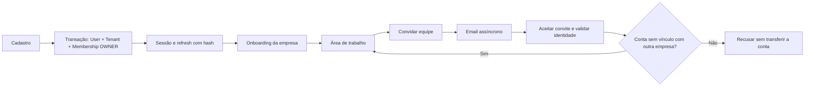
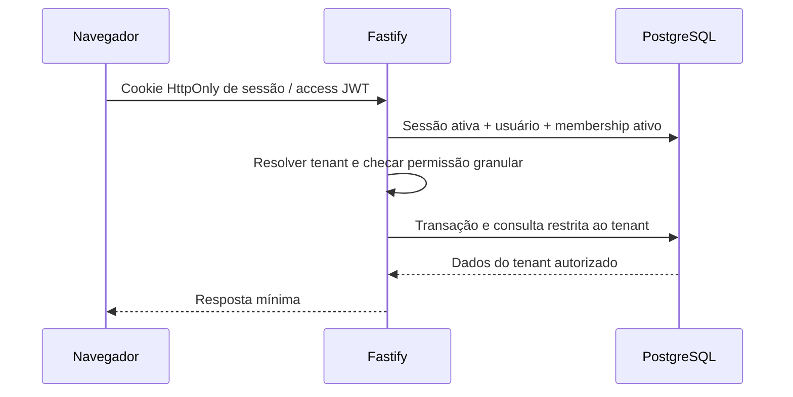
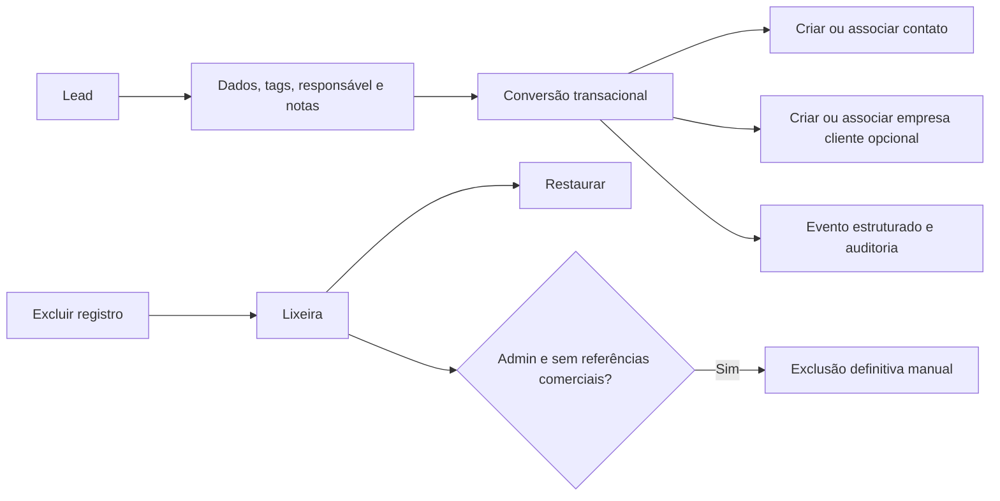
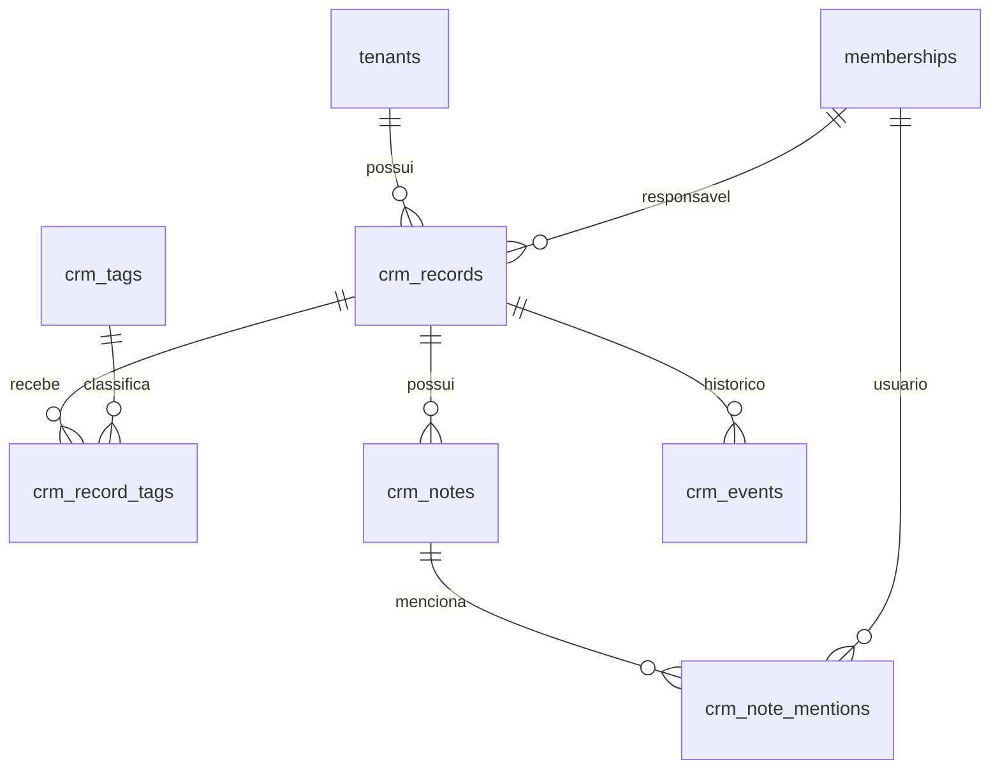
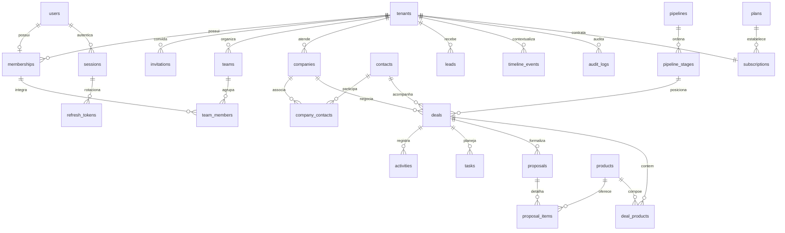

# Desmos CRM — arquitetura e contratos

Status: Fundação e CRM Core implementados. Desmos é um SaaS para empresas clientes independentes, com uma empresa por conta, conforme esclarecimento do usuário em 01/10/2026. Vendas e os demais módulos continuam no roadmap. O alcance e os resultados da verificação são registrados em [validação](validation.md).

## Escopo e organização

Monólito modular em TypeScript. Next.js (App Router) apresenta a interface; Fastify oferece a API REST; PostgreSQL é a fonte de verdade; Drizzle descreve o schema e migrações versionadas evoluem o banco. Redis mantém rate limits e um worker processa emails por outbox PostgreSQL; BullMQ fica planejado para importações, automações e trabalhos mais amplos. Não há microserviços, pagamentos ou integrações externas nesta etapa.

```text
orbit-crm/
  apps/
    web/                    # Next.js, React, Tailwind, React Query, RHF, Zod
      src/app/              # rotas, layouts e provedores
      src/components/ui/    # primitivas acessíveis
      src/features/         # auth, workspace, settings, crm
    api/
      src/modules/
        iam/                # identidade, sessão, refresh, permissões, convites
        tenants/            # cadastro, onboarding, configurações
        crm/                # contatos, empresas clientes, leads, tags, notas e timeline
        sales/              # pipelines, etapas, oportunidades, atividades e tarefas
      src/infrastructure/   # banco, email e fila
      src/shared/           # erros, autenticação e contratos internos
      test/                 # testes de domínio e integração
  docs/                     # decisões, modelo e roadmap
  tests/e2e/                # fluxos reais no navegador
  scripts/                  # ambiente local e verificação
  compose.yaml              # PostgreSQL, Redis e Mailpit
```

A marca pública é Desmos CRM. A pasta `orbit-crm`, os workspaces `@orbit/*`, bancos e serviços locais e os identificadores de cookies, issuer/audience e cache mantêm seus nomes internos por compatibilidade; esses nomes não representam a marca exibida ao usuário.

IAM e tenants separam políticas, casos de uso e HTTP. O módulo CRM mantém `routes.ts` e `schemas.ts` para transporte/validação, `service.ts` para os casos de uso e `tenant.ts` para o contexto transacional e a autorização. PostgreSQL/Drizzle e serviços compartilhados ficam na infraestrutura. A API não depende do frontend. Compartilhar tipos não substitui validação em runtime; novas subdivisões de domínio/aplicação/infraestrutura devem acompanhar responsabilidades concretas.

## Fluxos principais





O fluxo comercial entregue permite cadastrar um lead, registrar notas e menções e convertê-lo em contato com empresa cliente opcional. A conversão cria ou associa registros existentes, bloqueia referências estrangeiras/excluídas e é idempotente sob concorrência. A Fase 3 adiciona uma opção de oportunidade na mesma transação.



Mutações de registros e notas persistem eventos e auditoria na mesma transação. A timeline identifica campos alterados e apresenta nomes de responsáveis, empresas e tags; valores equivalentes de data/moeda ou tags apenas reordenadas não são descritos como mudanças de campo. Renomear ou remover tags registra o impacto nos registros associados e incrementa suas versões. O histórico de notas guarda conteúdo anterior/posterior na auditoria. Menções não disparam notificações nesta fase. A Fase 3 integra oportunidades, movimentações de etapas, ganho/perda, tarefas e atividades a esse histórico. Propostas e automações continuam futuras.

## Multi-tenancy e integridade

- Banco e schema compartilhados, discriminados por `tenant_id` UUID. `User` é global, com email de login único e normalizado. `Membership` liga usuário e empresa e armazena cargo/status. `UNIQUE (memberships.user_id)` limita cada conta a uma única empresa, inclusive quando o vínculo está suspenso. Cada novo cadastro cria uma empresa e seu OWNER na mesma transação.
- O contexto autenticado resolve `userId`, `sessionId`, `tenantId`, `membershipId` e permissões. Tenant de body/header nunca é autoridade. O ambiente vem da única associação ativa da conta; a interface identifica a empresa sem oferecer seletor nem criação de uma segunda empresa.
- Convites não transferem uma conta de outra empresa: criação e aceite recusam o conflito com `409 ACCOUNT_COMPANY_CONFLICT`, mesmo quando o vínculo existente está suspenso. O vínculo é protegido no banco, além da validação da aplicação.
- Consultas de negócio exigem tenant explícito; registros ausentes e registros de outra empresa têm a mesma resposta 404. Listas, contagens, relatórios, exportações e jobs obedecem ao mesmo contexto.
- As seis tabelas CRM e nove tabelas de Vendas têm RLS habilitada e forçada (`ENABLE`/`FORCE ROW LEVEL SECURITY`), com papel de runtime sem SUPERUSER/BYPASSRLS. `withCrmTenant` configura `app.tenant_id` somente dentro da transação; contexto ausente nega leitura/escrita comercial. Testes reais exercitam essas políticas com o papel da aplicação. IAM, tenants e auditoria da fundação continuam com autorização e consultas explícitas, sem RLS; IAM precisa resolver o membership antes do contexto comercial.
- Referências CRM usam FKs compostas `(tenant_id, id)` ou `(tenant_id, id, kind)`, inclusive associações de tags, notas, menções e eventos. Responsáveis/autores/menções referenciam `(tenant_id, user_id)` de memberships; a aplicação valida membros ativos. Índices começam por tenant, seguidos por filtros/ordenação. Email e telefone comerciais normalizados geram alertas de duplicidade no mesmo tenant e tipo de registro, sem constraint UNIQUE e sem impedir persistência. Apenas email de login é único globalmente.
- Datas em UTC (`timestamptz`), apresentação no fuso da empresa; dinheiro em centavos ou numeric exato, nunca float. UUIDs para identidades.
- Concorrência: transações no cadastro, convite, rotação e eventos; bloqueio de linha na rotação de refresh e proteção do último OWNER. Registros CRM já exigem `version` em PATCH e retornam `409 VERSION_CONFLICT` em edição concorrente. Exclusão, restauração e conversão usam locks; mudanças de tags e suas associações são serializadas por tenant para evitar inversão de locks. Idempotência de jobs/importação e contador transacional de round robin pertencem às fases futuras.

## Autenticação e autorização

- Senha com hash scrypt (N=131072, r=8, p=1, limite de memória 256 MiB) e salt aleatório; parâmetros armazenados no hash. Hashes legados do desenvolvimento migram no próximo login válido. Senhas nunca aparecem em logs ou retornos. Os parâmetros seguem a [orientação OWASP para scrypt](https://cheatsheetseries.owasp.org/cheatsheets/Password_Storage_Cheat_Sheet.html).
- Access JWT curto (15 minutos), assinado com segredo do ambiente, issuer/audience verificados. Refresh opaco aleatório com validade de 30 dias, apenas SHA-256 no banco, rotacionado em uso e vinculado a sessão rastreável.
- Cookies HttpOnly, SameSite=Lax, Secure em produção. Requisições mutáveis via cookies exigem Origin permitido; CORS usa origem explícita. Credenciais não ficam em localStorage. Frontend coordena refresh para evitar concorrência da mesma aba; coordenação entre abas usa Web Locks quando disponível.
- Token antigo reapresentado revoga a família/sessão. Revogação, bloqueio de membership e alteração de papel têm efeito na próxima requisição, inclusive com access token ainda válido.
- Recuperação/verificação/convites usam tokens aleatórios, armazenados com hash, uso único e expiração. Recuperação não revela se email existe. Reset invalida sessões.
- OWNER, ADMIN, MANAGER, SALES, SUPPORT e VIEWER mapeiam para permissões granulares. `settings.manage`, `users.manage` e `audit.view` são verificadas no backend. Sessões próprias são acessíveis a todos os papéis. Só OWNER promove/rebaixa OWNER; nunca remover o último proprietário ativo.
- Limite global de 200/minuto por usuário de JWT verificado, compartilhado entre suas sessões. Acesso anônimo ou token inválido usa limite por IP; usuários atrás do proxy não disputam uma cota única. Login/recuperação mantêm limites mais estritos por identidade. Respostas de bloqueio são 429 com Retry-After. Proteções incluem Zod com objetos estritos, limite de payload, headers seguros, erro compreensível, logs estruturados com request id e redaction.
- Emails locais chegam ao Mailpit. Publicação real exige SMTP configurado, HTTPS, gestão de segredos e validação operacional. Não há envio real sem configuração.

## Contrato da Fase 1

API sem prefixo, frontend pode usar proxy same-origin `/api`. Datas ISO 8601. Erro: `{ error: { code, message } }`. Listas desta fase: `{ items: [...] }`. Não retornar hashes/tokens de uso único.

| Método/rota                      | Entrada ou saída principal                                                                                                                                                                    |
| -------------------------------- | --------------------------------------------------------------------------------------------------------------------------------------------------------------------------------------------- |
| POST /auth/register              | `{ name, email, password, companyName }` → usuário/sessão; 201                                                                                                                                |
| POST /auth/login                 | `{ email, password }` → sessão; 200                                                                                                                                                           |
| POST /auth/refresh               | cookie de refresh → cookies rotacionados                                                                                                                                                      |
| POST /auth/logout                | revoga sessão e limpa cookies                                                                                                                                                                 |
| POST /auth/forgot-password       | `{ email }` → mensagem neutra                                                                                                                                                                 |
| POST /auth/reset-password        | `{ token, password }`                                                                                                                                                                         |
| POST /auth/verify-email          | `{ token }`                                                                                                                                                                                   |
| POST /auth/resend-verification   | autenticado                                                                                                                                                                                   |
| GET /me                          | `{ user, tenant, membership, permissions, memberships }`                                                                                                                                      |
| PATCH /me                        | `{ name, phone? }`                                                                                                                                                                            |
| GET /tenants                     | compatibilidade: lista com a única empresa ativa da conta                                                                                                                                     |
| POST /tenants                    | compatibilidade: recusa segunda empresa com `409 ONE_COMPANY_PER_ACCOUNT`                                                                                                                     |
| POST /auth/switch-tenant         | compatibilidade: `{ tenantId }` só admite a própria empresa; outra empresa retorna 404                                                                                                        |
| GET /tenants/current             | empresa atual                                                                                                                                                                                 |
| PATCH /tenants/current           | dados básicos da empresa, `settings.manage`                                                                                                                                                   |
| POST /tenants/current/onboarding | `{ segment, employeeCount, salesCount, objective, salesMotion }`, `settings.manage`                                                                                                           |
| GET /memberships                 | membros da empresa atual, `users.manage`                                                                                                                                                      |
| PATCH /memberships/:id           | `{ role?, status? }`, `users.manage` e política OWNER                                                                                                                                         |
| GET /invitations                 | convites da empresa atual, `users.manage`                                                                                                                                                     |
| POST /invitations                | `{ email, role }`, `users.manage`; conta de outra empresa retorna `409 ACCOUNT_COMPANY_CONFLICT`                                                                                              |
| POST /auth/accept-invitation     | `{ token, name?, password? }`; usuário existente deve autenticar com mesmo email ou fornecer sua senha atual, sem redefini-la; conta vinculada a outra empresa é recusada, inclusive suspensa |
| GET /sessions                    | sessões do próprio usuário                                                                                                                                                                    |
| DELETE /sessions/:id             | revoga sessão do próprio usuário                                                                                                                                                              |
| GET /audit-logs                  | eventos administrativos do tenant, `audit.view`                                                                                                                                               |
| GET /health, GET /ready          | liveness e readiness com dependências                                                                                                                                                         |

`user`: id, name, email, phone, emailVerifiedAt. `tenant`: id, name, segment, employeeCount, salesCount, objective, salesMotion, onboardingCompletedAt, timezone, currency, locale e campos de contato. `membership`: id, role, status. `memberships`: campo de compatibilidade com no máximo a associação da conta (id, tenantId, tenantName, role, status). `permissions`: string[]. Respostas de login/cadastro devem permitir refetch de `/me`.

## Contrato e armazenamento da Fase 2

O [contrato do CRM Core](crm-core-contract.md) detalha os campos e endpoints. `/crm/contacts`, `/crm/companies` e `/crm/leads` oferecem lista paginada, detalhe, criação e PATCH com versão. As listas usam `page`/`pageSize`, busca, filtros e ordenação permitida; uma consulta obtém página e total no mesmo snapshot. As rotas subordinadas oferecem notas, timeline, restauração e exclusão definitiva; `/crm/tags` e `/crm/assignees` fornecem tags e membros ativos. A conversão fica em `POST /crm/leads/:id/convert`.

`companies` representa organizações atendidas por um cliente do SaaS, enquanto `tenants` representa o ambiente desse cliente. A migração `0004_crm_core.sql` cria seis tabelas físicas:

| Tabela              | Responsabilidade                                                                                                                      |
| ------------------- | ------------------------------------------------------------------------------------------------------------------------------------- |
| `crm_records`       | Campos tipados de contatos, empresas clientes e leads, separados por `kind`; `version`, `deleted_at`, vínculos de empresa e conversão |
| `crm_tags`          | Taxonomia e cores da própria empresa, com nome único no tenant                                                                        |
| `crm_record_tags`   | Associação com FKs compostas para registro e tag                                                                                      |
| `crm_notes`         | Texto simples, autor, fixação e datas, vinculado a um registro                                                                        |
| `crm_note_mentions` | Menções a usuários da mesma empresa, sem envio de notificações                                                                        |
| `crm_events`        | Eventos estruturados com ator, tipo, data e metadata por registro                                                                     |



A identidade comum de `crm_records` permite FKs reais em notas/tags/eventos, sem referências polimórficas órfãs. DTOs, validação e permissões continuam específicos por tipo. `company_id` relaciona contatos/leads a empresas clientes; a FK inclui `kind` para impedir associação a um contato ou lead como empresa.

OWNER/ADMIN têm todas as permissões CRM; MANAGER não pode excluir definitivamente; SALES pode consultar/criar/editar/converter e gerenciar tags, mas não excluir; SUPPORT consulta o CRM e edita contatos/empresas; VIEWER apenas consulta. Notas exigem `update` da entidade. Lixeira e restauração exigem permissão de exclusão; purge exige `crm.purge`, registro já na lixeira e ausência de referências comerciais, inclusive excluídas. A exclusão definitiva remove notas, menções, tags associadas e eventos do registro, preservando a auditoria. Retenção configurável e limpeza automática ainda não existem.

## Modelo conceitual de evolução, por responsabilidade



Entidades tenant-owned usam `id`, `tenantId` e datas de controle; registros comerciais mutáveis incluem `version` e `deletedAt`. Este diagrama é conceitual e inclui módulos futuros. `contacts`, `companies`, `leads`, `tags` e seus históricos estão fisicamente nas seis tabelas CRM descritas acima; `company_contacts`, arquivos, equipes, negócios e demais módulos não são tabelas entregues pela Fase 2.

| Módulo             | Entidades e campos relevantes                                                                                                                                                     | Responsabilidade                                                             |
| ------------------ | --------------------------------------------------------------------------------------------------------------------------------------------------------------------------------- | ---------------------------------------------------------------------------- |
| IAM                | users; memberships(userId UNIQUE, tenantId, role, status); roles; permissions; role_permissions; sessions; refresh_tokens; invitations; action_tokens                             | identidade e políticas de acesso; cargos customizados evoluem o mapa inicial |
| Tenants            | tenants; teams; team_members                                                                                                                                                      | empresa da conta, onboarding, configurações, estrutura comercial             |
| CRM Core           | contacts(name, email, phone, assignedTo); companies(name, taxId); company_contacts; leads(source, temperature, lastContactAt, nextContactAt); tags; tag_assignments; notes; files | relacionamento, duplicidade, conversão e histórico                           |
| Vendas             | pipelines; pipeline_stages(position, probability, color); deals(value, currency, stageId, probability, status, expectedCloseDate, wonAt, lostAt); lost_reasons; deal_products     | movimentação consistente e fechamento                                        |
| Trabalho           | activities(type, scheduledAt, completedAt, result); tasks(priority, status, dueAt, assignedTo)                                                                                    | agenda, tarefas, follow-up e timeline                                        |
| Comercial avançado | products(sku, price, active); proposals(number, status, validUntil, total); proposal_items(quantity, unitPrice, discount); custom_fields; custom_field_values; lead_sources       | catálogo, propostas e configuração por segmento                              |
| Automação          | automations(trigger, conditions, actions); automation_runs(idempotencyKey, status, attempts)                                                                                      | regras limitadas por tenant, execução rastreável e sem recursão infinita     |
| Gestão             | goals(metric, target, period, membershipId); saved_filters; notifications; timeline_events(actorId, type, subjectId, metadata); audit_logs(before, after, requestId)              | acompanhamento, pesquisa, auditoria e radar por regras                       |
| Plataforma         | plans; subscriptions; feature_limits; usage; api_keys; webhooks; webhook_deliveries; outbox                                                                                       | entitlements centralizados, integrações, entrega assíncrona e limites        |

Tags, notas e eventos atuais validam tenant e referências por FKs compostas e casos de uso. Campos customizados e novos relacionamentos deverão manter essa integridade ao serem adicionados. Valores de requisição são parametrizados; nomes de colunas de filtros e ordenação seguem allowlists. A paginação CRM atual usa página/offset e desempate por UUID; cursor pagination continua planejada para listas maiores.

## UI e operações

Interface pt-BR com sidebar sóbria, fundo `#F7F8FB`, marca Desmos e símbolo de elos em índigo `#4F46E5`, tabelas densas, bordas sutis e dark mode. A empresa da conta aparece com nome e ícone estáticos na barra lateral. O CRM tem listas por entidade, cadastro/edição em página própria, detalhe com notas/timeline, tags e lixeira. Componentes acessíveis, foco visível, labels, feedback de erros/sucesso, skeletons e estados vazios úteis. Navegação funcional expõe apenas módulos entregues; indicadores de vendas não são inventados.

O seed cria Nexa Tecnologia, Ana OWNER (`ana@nexa.com`), Felipe MANAGER, Lucas e Mariana SALES. Horizonte Consultoria tem um proprietário separado: Bruno Almeida (`bruno@horizonte.com`). Ana pertence somente à Nexa; cada conta de demonstração tem uma única empresa. O seed CRM idempotente acrescenta 20 empresas clientes, 60 contatos e 30 leads fictícios à Nexa, além de tags, notas e eventos. IDs estáveis preservam registros já existentes. Oportunidades, produtos, tarefas e propostas ficam para suas fases.

Readiness verifica PostgreSQL/Redis. Logs não incluem corpo sensível, cookies ou authorization. Emails usam fila/outbox com retries e observabilidade; falha no SMTP não desfaz cadastro confirmado. Banco local possui volume nomeado; a migração da restrição de uma empresa por conta exige resolver vínculos legados duplicados antes de aplicar a unicidade. O seed ajusta apenas o vínculo demonstrativo legado de Ana com a Horizonte, preservando os dados das empresas e criando o proprietário separado. Backups, restauração, gestão de segredos, observabilidade externa e revisão de segurança antecedem clientes reais.

## Referências técnicas

- [Next.js: instalação](https://nextjs.org/docs/app/getting-started/installation)
- [Fastify: plugins e composição](https://fastify.dev/docs/latest/Guides/Getting-Started/)
- [PostgreSQL: Row Security Policies](https://www.postgresql.org/docs/17/ddl-rowsecurity.html)

## Vendas — Fase 3

`modules/sales` reutiliza a transação comercial com autorização atualizada e RLS. Pipelines e etapas são próprios de cada tenant; a FK `(tenant_id,pipeline_id,stage_id)` impede mover para etapa de outro pipeline ou empresa. PATCH de pipelines, oportunidades, atividades e tarefas exige versão. Alterações de tags são serializadas com as associações e incrementam versões de CRM e Vendas.

Dinheiro trafega como string decimal e usa `numeric(16,2)` no banco. Valor ponderado é calculado em SQL; comparações de centavos usam BigInt. O Kanban agrupa totais por moeda e limita cartões a 100 por coluna, indicando acesso à listagem paginada. Ganho/perda/reabertura preservam timestamps consistentes e snapshots na timeline/auditoria.

Atividades e tarefas usam `sales_work` com discriminador e constraints por tipo. Há FKs reais para oportunidades e registros CRM. Conclusão pode criar uma tarefa de follow-up com unicidade por `source_activity_id`; datas inválidas causam rollback integral. Filtros Hoje/Próximas usam o fuso da empresa; entrada datetime-local usa o fuso do dispositivo, explicitado no formulário. A conclusão de atividade vinculada a lead atualiza último/próximo contato.

Conversão CRM aceita uma continuação transacional de Vendas, sem dependência circular entre módulos. O lead bloqueado guarda `converted_deal_id`, e repetições retornam a mesma oportunidade. Referências comerciais bloqueiam purga CRM, inclusive registros de vendas na lixeira. A migração `0005_sales.sql` define nove tabelas, constraints, índices e RLS forçada. Contrato HTTP e permissões: [Vendas](sales-contract.md).
